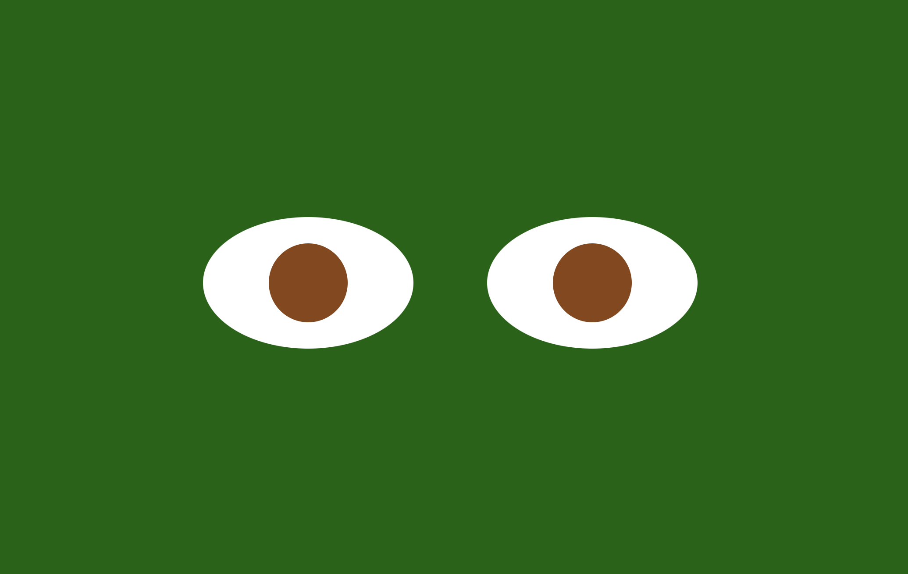

# Eye-Movement

## Description
This Project is an interactive web page. The eyes you see on the screen will follow your mouse movements on this web page.

## How to Run
Please follow this [link](https://oksanawalters.github.io/Eye-Movement/) to test it yourself. When the page is loaded, move your mouse around.

## Future Improvements
This page can be improved by adding more CSS, e.g. the other parts of the face.

## License Information
[MIT](https://choosealicense.com/licenses/mit/)
